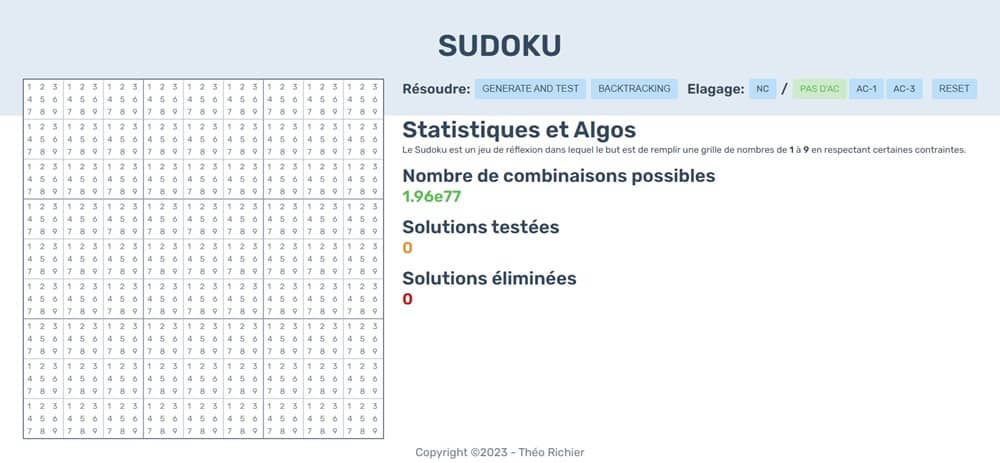

# Sudoku in TypeScript

| Runtime JS                | Update dependencies | NVM Version |
|:--------------------------|:--------------------|:------------|
| [Bun.sh](https://bun.sh/) | 9 November 2023     | `16`        |



## Description

Welcome to the **ACF** / **Contact Form 7** WordPress Theme, **“Inkognito”**.
This sleek, modern and fully responsive theme designed
specifically for tattoo studios, artists and enthusiasts. Made with precision and a deep understanding of tattooing
industry, this theme encapsulates the essence of art and creativity that defines the world of tattooing. If
you present your portfolio, make an appointment or share your tattoo journey, Inkognito is the perfect digital
canvas to bring your studio's online presence to life.

## Requirements

- [NVM](https://github.com/nvm-sh/nvm)
- [Bun.sh](https://bun.sh/)

## Installation

Run the command:

```
./build.sh
```

Possible arguments: `dev` 

## How to compile CSS assets?

Run the command:

```
npm run sass
```

## Auteur

- [**RICHIER Théo**](https://github.com/VidarDev)
- [**TongTwist**](https://github.com/tongtwist)
